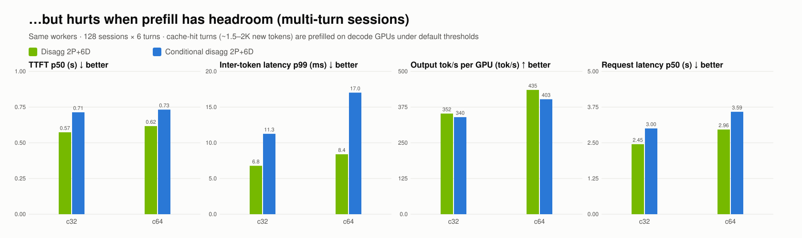

# …but hurts when prefill has headroom (multi-turn sessions)

| Concurrency | Configuration | Valid/errors | TTFT p50 (s) | Inter-token latency p99 (ms) | Output tok/s per GPU (tok/s) | Request latency p50 (s) |
| --- | --- | --- | --- | --- | --- | --- |
| 32 | mt-c2p6d-pd | 768/0 | 0.57 | 6.8 | 352 | 2.45 |
| 32 | mt-c2p6d-cpd | 768/0 | 0.71 | 11.3 | 340 | 3.00 |
| 64 | mt-c2p6d-pd | 768/0 | 0.62 | 8.4 | 435 | 2.96 |
| 64 | mt-c2p6d-cpd | 768/0 | 0.73 | 17.0 | 403 | 3.59 |

- c32: **mt-c2p6d-pd** vs mt-c2p6d-cpd: TTFT p50 1.24×, Inter-token latency p99 1.66×, Output tok/s per GPU 1.04×, Request latency p50 1.23× (>1 means the first configuration is better)
- c64: **mt-c2p6d-pd** vs mt-c2p6d-cpd: TTFT p50 1.19×, Inter-token latency p99 2.03×, Output tok/s per GPU 1.08×, Request latency p50 1.21× (>1 means the first configuration is better)
