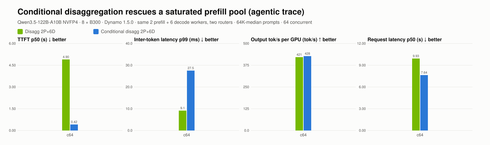

# Conditional disaggregation rescues a saturated prefill pool (agentic trace)

| Concurrency | Configuration | Valid/errors | TTFT p50 (s) | Inter-token latency p99 (ms) | Output tok/s per GPU (tok/s) | Request latency p50 (s) |
| --- | --- | --- | --- | --- | --- | --- |
| 64 | c2p6d-pd | 800/0 | 4.90 | 9.1 | 421 | 9.93 |
| 64 | c2p6d-cpd | 800/0 | 0.42 | 27.5 | 428 | 7.64 |

- c64: **c2p6d-pd** vs c2p6d-cpd: TTFT p50 0.08×, Inter-token latency p99 3.01×, Output tok/s per GPU 0.99×, Request latency p50 0.77× (>1 means the first configuration is better)
