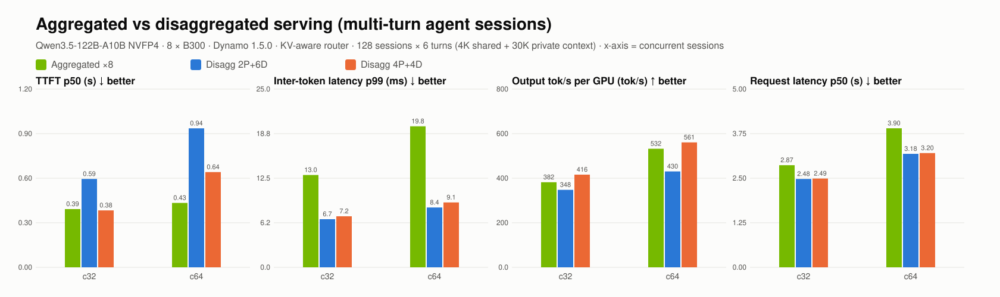

# Aggregated vs disaggregated serving (multi-turn agent sessions)

| Concurrency | Configuration | Valid/errors | TTFT p50 (s) | Inter-token latency p99 (ms) | Output tok/s per GPU (tok/s) | Request latency p50 (s) |
| --- | --- | --- | --- | --- | --- | --- |
| 32 | mt-agg8-kv | 768/0 | 0.39 | 13.0 | 382 | 2.87 |
| 32 | mt-d2p6d | 768/0 | 0.59 | 6.7 | 348 | 2.48 |
| 32 | mt-d4p4d | 768/0 | 0.38 | 7.2 | 416 | 2.49 |
| 64 | mt-agg8-kv | 768/0 | 0.43 | 19.8 | 532 | 3.90 |
| 64 | mt-d2p6d | 768/0 | 0.94 | 8.4 | 430 | 3.18 |
| 64 | mt-d4p4d | 768/0 | 0.64 | 9.1 | 561 | 3.20 |

- c32: **mt-agg8-kv** vs mt-d2p6d: TTFT p50 1.52×, Inter-token latency p99 0.52×, Output tok/s per GPU 1.10×, Request latency p50 0.87× (>1 means the first configuration is better)
- c32: **mt-agg8-kv** vs mt-d4p4d: TTFT p50 0.98×, Inter-token latency p99 0.55×, Output tok/s per GPU 0.92×, Request latency p50 0.87× (>1 means the first configuration is better)
- c64: **mt-agg8-kv** vs mt-d2p6d: TTFT p50 2.16×, Inter-token latency p99 0.42×, Output tok/s per GPU 1.24×, Request latency p50 0.82× (>1 means the first configuration is better)
- c64: **mt-agg8-kv** vs mt-d4p4d: TTFT p50 1.48×, Inter-token latency p99 0.46×, Output tok/s per GPU 0.95×, Request latency p50 0.82× (>1 means the first configuration is better)
