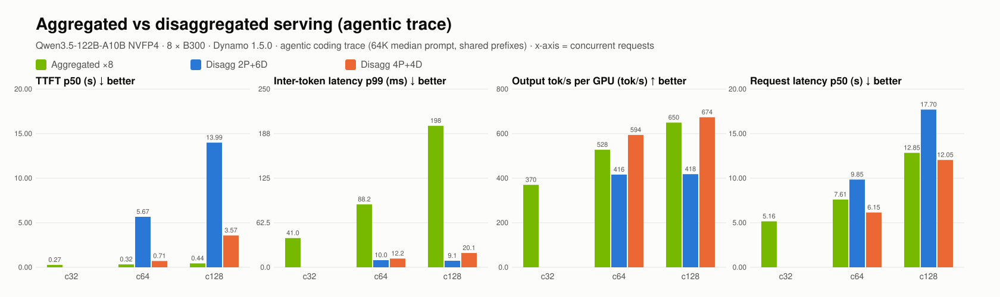

# Aggregated vs disaggregated serving (agentic trace)

| Concurrency | Configuration | Valid/errors | TTFT p50 (s) | Inter-token latency p99 (ms) | Output tok/s per GPU (tok/s) | Request latency p50 (s) |
| --- | --- | --- | --- | --- | --- | --- |
| 32 | agg8-kv | 800/0 | 0.27 | 41.0 | 370 | 5.16 |
| 64 | agg8-kv | 800/0 | 0.32 | 88.2 | 528 | 7.61 |
| 64 | d2p6d | 800/0 | 5.67 | 10.0 | 416 | 9.85 |
| 64 | d4p4d | 800/0 | 0.71 | 12.2 | 594 | 6.15 |
| 128 | agg8-kv | 800/0 | 0.44 | 198 | 650 | 12.85 |
| 128 | d2p6d | 800/0 | 13.99 | 9.1 | 418 | 17.70 |
| 128 | d4p4d | 800/0 | 3.57 | 20.1 | 674 | 12.05 |

- c64: **agg8-kv** vs d2p6d: TTFT p50 17.51×, Inter-token latency p99 0.11×, Output tok/s per GPU 1.27×, Request latency p50 1.29× (>1 means the first configuration is better)
- c64: **agg8-kv** vs d4p4d: TTFT p50 2.18×, Inter-token latency p99 0.14×, Output tok/s per GPU 0.89×, Request latency p50 0.81× (>1 means the first configuration is better)
- c128: **agg8-kv** vs d2p6d: TTFT p50 31.71×, Inter-token latency p99 0.05×, Output tok/s per GPU 1.55×, Request latency p50 1.38× (>1 means the first configuration is better)
- c128: **agg8-kv** vs d4p4d: TTFT p50 8.10×, Inter-token latency p99 0.10×, Output tok/s per GPU 0.96×, Request latency p50 0.94× (>1 means the first configuration is better)
