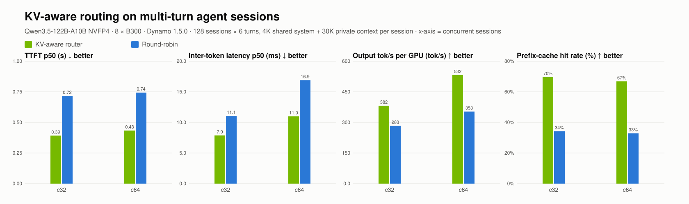

# KV-aware routing on multi-turn agent sessions

| Concurrency | Configuration | Valid/errors | TTFT p50 (s) | Inter-token latency p50 (ms) | Output tok/s per GPU (tok/s) | Prefix-cache hit rate (%) |
| --- | --- | --- | --- | --- | --- | --- |
| 32 | mt-agg8-kv | 768/0 | 0.39 | 7.9 | 382 | 70% |
| 32 | mt-agg8-rr | 768/0 | 0.72 | 11.1 | 283 | 34% |
| 64 | mt-agg8-kv | 768/0 | 0.43 | 11.0 | 532 | 67% |
| 64 | mt-agg8-rr | 768/0 | 0.74 | 16.9 | 353 | 33% |

- c32: **mt-agg8-kv** vs mt-agg8-rr: TTFT p50 1.83×, Inter-token latency p50 1.41×, Output tok/s per GPU 1.35× (>1 means the first configuration is better)
- c64: **mt-agg8-kv** vs mt-agg8-rr: TTFT p50 1.71×, Inter-token latency p50 1.54×, Output tok/s per GPU 1.51× (>1 means the first configuration is better)
