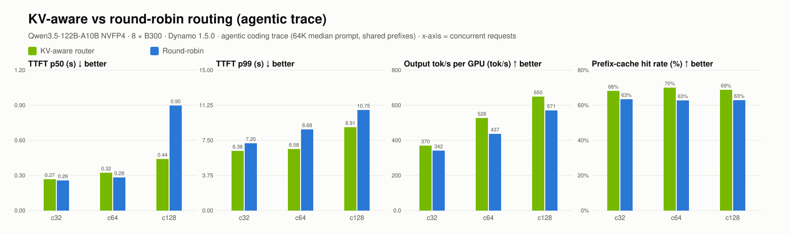

# KV-aware vs round-robin routing (agentic trace)

| Concurrency | Configuration | Valid/errors | TTFT p50 (s) | TTFT p99 (s) | Output tok/s per GPU (tok/s) | Prefix-cache hit rate (%) |
| --- | --- | --- | --- | --- | --- | --- |
| 32 | agg8-kv | 800/0 | 0.27 | 6.38 | 370 | 68% |
| 32 | agg8-rr | 800/0 | 0.26 | 7.20 | 342 | 63% |
| 64 | agg8-kv | 800/0 | 0.32 | 6.58 | 528 | 70% |
| 64 | agg8-rr | 800/0 | 0.28 | 8.68 | 437 | 63% |
| 128 | agg8-kv | 800/0 | 0.44 | 8.91 | 650 | 69% |
| 128 | agg8-rr | 800/0 | 0.90 | 10.75 | 571 | 63% |

- c32: **agg8-kv** vs agg8-rr: TTFT p50 0.96×, TTFT p99 1.13×, Output tok/s per GPU 1.08× (>1 means the first configuration is better)
- c64: **agg8-kv** vs agg8-rr: TTFT p50 0.88×, TTFT p99 1.32×, Output tok/s per GPU 1.21× (>1 means the first configuration is better)
- c128: **agg8-kv** vs agg8-rr: TTFT p50 2.04×, TTFT p99 1.21×, Output tok/s per GPU 1.14× (>1 means the first configuration is better)
