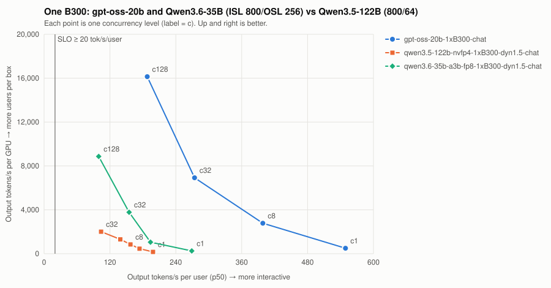

# One B300: gpt-oss-20b and Qwen3.6-35B (ISL 800/OSL 256) vs Qwen3.5-122B (800/64)

| Series | Conc | Valid | Req/s | Out tok/s | GPUs | Out tok/s/GPU | tok/s/user p50 | TTFT p50/p99 ms | ITL p50/p99 ms | E2E p99 ms | SLO |
| --- | ---: | --- | ---: | ---: | ---: | ---: | ---: | ---: | ---: | ---: | --- |
| gpt-oss-20b-1xB300-chat | 1 | 16/16 | 1.94 | 496 | 1 | 496 | 549.0 | 47/50 | 1.8/1.8 | 518 | ✓ |
| gpt-oss-20b-1xB300-chat | 8 | 32/32 | 10.85 | 2,777 | 1 | 2,777 | 398.5 | 76/135 | 2.5/2.8 | 757 | ✓ |
| gpt-oss-20b-1xB300-chat | 32 | 128/128 | 27.03 | 6,919 | 1 | 6,919 | 274.1 | 241/285 | 3.6/3.9 | 1,269 | ✓ |
| gpt-oss-20b-1xB300-chat | 128 | 512/512 | 63.04 | 16,138 | 1 | 16,138 | 187.9 | 574/833 | 5.3/7.1 | 2,206 | ✓ |
| qwen3.5-122b-nvfp4-1xB300-dyn1.5-chat | 1 | 16/16 | 2.55 | 163 | 1 | 163 | 198.4 | 69/73 | 5.0/5.1 | 391 | ✓ |
| qwen3.5-122b-nvfp4-1xB300-dyn1.5-chat | 4 | 32/32 | 7.16 | 458 | 1 | 458 | 173.8 | 196/223 | 5.8/5.8 | 581 | ✓ |
| qwen3.5-122b-nvfp4-1xB300-dyn1.5-chat | 8 | 64/64 | 13.21 | 845 | 1 | 845 | 157.3 | 197/216 | 6.4/6.4 | 616 | ✓ |
| qwen3.5-122b-nvfp4-1xB300-dyn1.5-chat | 16 | 128/128 | 20.40 | 1,306 | 1 | 1,306 | 138.9 | 320/341 | 7.2/7.7 | 805 | ✓ |
| qwen3.5-122b-nvfp4-1xB300-dyn1.5-chat | 32 | 256/256 | 31.33 | 2,005 | 1 | 2,005 | 103.8 | 401/486 | 9.6/12.6 | 1,039 | ✓ |
| qwen3.6-35b-a3b-fp8-1xB300-dyn1.5-chat | 1 | 16/16 | 0.99 | 252 | 1 | 252 | 269.0 | 60/66 | 3.7/3.7 | 1,014 | ✓ |
| qwen3.6-35b-a3b-fp8-1xB300-dyn1.5-chat | 8 | 32/32 | 4.10 | 1,051 | 1 | 1,051 | 193.8 | 193/1,941 | 5.2/5.2 | 3,253 | ✓ |
| qwen3.6-35b-a3b-fp8-1xB300-dyn1.5-chat | 32 | 128/128 | 14.75 | 3,777 | 1 | 3,777 | 154.9 | 410/861 | 6.5/7.1 | 2,498 | ✓ |
| qwen3.6-35b-a3b-fp8-1xB300-dyn1.5-chat | 128 | 512/512 | 34.64 | 8,868 | 1 | 8,868 | 99.5 | 966/1,590 | 10.1/13.4 | 4,035 | ✓ |

SLO: TTFT p99 ≤ 2000 ms and per-user decode ≥ 20 tok/s. Failed points are failures, not low throughput — never average them in.
- **gpt-oss-20b-1xB300-chat**: highest SLO-passing concurrency = 128 → ≈ 853 active users at an assumed 15% duty cycle (fraction of wall-clock a user has a request in flight; measure yours from gateway logs).
- **qwen3.5-122b-nvfp4-1xB300-dyn1.5-chat**: highest SLO-passing concurrency = 32 → ≈ 213 active users at an assumed 15% duty cycle (fraction of wall-clock a user has a request in flight; measure yours from gateway logs).
- **qwen3.6-35b-a3b-fp8-1xB300-dyn1.5-chat**: highest SLO-passing concurrency = 128 → ≈ 853 active users at an assumed 15% duty cycle (fraction of wall-clock a user has a request in flight; measure yours from gateway logs).
