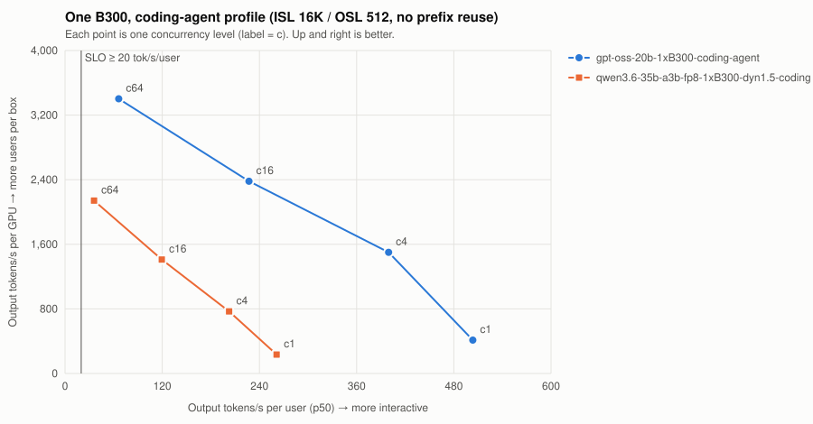

# One B300, coding-agent profile (ISL 16K / OSL 512, no prefix reuse)

| Series | Conc | Valid | Req/s | Out tok/s | GPUs | Out tok/s/GPU | tok/s/user p50 | TTFT p50/p99 ms | ITL p50/p99 ms | E2E p99 ms | SLO |
| --- | ---: | --- | ---: | ---: | ---: | ---: | ---: | ---: | ---: | ---: | --- |
| gpt-oss-20b-1xB300-coding-agent | 1 | 16/16 | 0.81 | 413 | 1 | 413 | 503.4 | 172/186 | 2.0/2.5 | 1,450 | ✓ |
| gpt-oss-20b-1xB300-coding-agent | 4 | 16/16 | 2.93 | 1,501 | 1 | 1,501 | 399.5 | 74/77 | 2.5/2.5 | 1,359 | ✓ |
| gpt-oss-20b-1xB300-coding-agent | 16 | 64/64 | 4.65 | 2,381 | 1 | 2,381 | 227.1 | 1,016/2,027 | 4.4/6.8 | 4,698 | ✓ |
| gpt-oss-20b-1xB300-coding-agent | 64 | 256/256 | 6.65 | 3,402 | 1 | 3,402 | 66.2 | 1,038/8,041 | 15.1/20.8 | 18,202 | ✗ |
| qwen3.6-35b-a3b-fp8-1xB300-dyn1.5-coding-agent | 1 | 16/16 | 0.46 | 234 | 1 | 234 | 261.2 | 215/227 | 3.8/3.8 | 2,185 | ✓ |
| qwen3.6-35b-a3b-fp8-1xB300-dyn1.5-coding-agent | 4 | 16/16 | 1.50 | 769 | 1 | 769 | 202.5 | 137/146 | 4.9/5.0 | 2,668 | ✓ |
| qwen3.6-35b-a3b-fp8-1xB300-dyn1.5-coding-agent | 16 | 64/64 | 2.76 | 1,411 | 1 | 1,411 | 119.5 | 1,486/3,285 | 8.4/11.7 | 7,846 | ✗ |
| qwen3.6-35b-a3b-fp8-1xB300-dyn1.5-coding-agent | 64 | 256/256 | 4.18 | 2,141 | 1 | 2,141 | 35.8 | 2,882/13,068 | 27.9/35.1 | 28,717 | ✗ |

SLO: TTFT p99 ≤ 3000 ms and per-user decode ≥ 20 tok/s. Failed points are failures, not low throughput — never average them in.
- **gpt-oss-20b-1xB300-coding-agent**: highest SLO-passing concurrency = 16 → ≈ 107 active users at an assumed 15% duty cycle (fraction of wall-clock a user has a request in flight; measure yours from gateway logs).
- **qwen3.6-35b-a3b-fp8-1xB300-dyn1.5-coding-agent**: highest SLO-passing concurrency = 4 → ≈ 27 active users at an assumed 15% duty cycle (fraction of wall-clock a user has a request in flight; measure yours from gateway logs).
