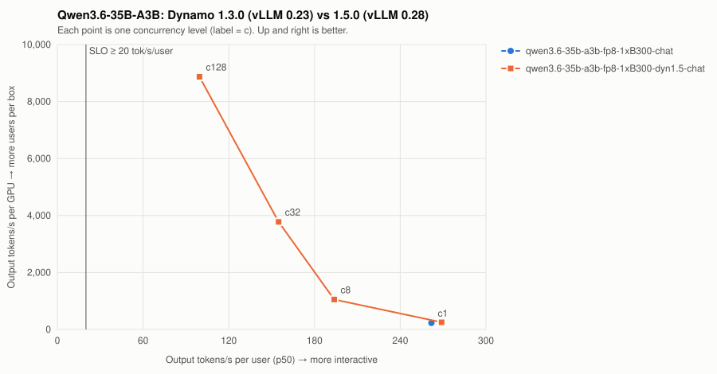

# Qwen3.6-35B-A3B: Dynamo 1.3.0 (vLLM 0.23) vs 1.5.0 (vLLM 0.28)

| Series | Conc | Valid | Req/s | Out tok/s | GPUs | Out tok/s/GPU | tok/s/user p50 | TTFT p50/p99 ms | ITL p50/p99 ms | E2E p99 ms | SLO |
| --- | ---: | --- | ---: | ---: | ---: | ---: | ---: | ---: | ---: | ---: | --- |
| qwen3.6-35b-a3b-fp8-1xB300-chat | 1 | 16/16 | 0.89 | 228 | 1 | 228 | 261.8 | 139/143 | 3.8/3.8 | 1,121 | ✓ |
| qwen3.6-35b-a3b-fp8-1xB300-chat | 8 | **FAILED** (24/32) | — | — | — | — | — | — | — | — | ✗ |
| qwen3.6-35b-a3b-fp8-1xB300-dyn1.5-chat | 1 | 16/16 | 0.99 | 252 | 1 | 252 | 269.0 | 60/66 | 3.7/3.7 | 1,014 | ✓ |
| qwen3.6-35b-a3b-fp8-1xB300-dyn1.5-chat | 8 | 32/32 | 4.10 | 1,051 | 1 | 1,051 | 193.8 | 193/1,941 | 5.2/5.2 | 3,253 | ✓ |
| qwen3.6-35b-a3b-fp8-1xB300-dyn1.5-chat | 32 | 128/128 | 14.75 | 3,777 | 1 | 3,777 | 154.9 | 410/861 | 6.5/7.1 | 2,498 | ✓ |
| qwen3.6-35b-a3b-fp8-1xB300-dyn1.5-chat | 128 | 512/512 | 34.64 | 8,868 | 1 | 8,868 | 99.5 | 966/1,590 | 10.1/13.4 | 4,035 | ✓ |

SLO: TTFT p99 ≤ 2000 ms and per-user decode ≥ 20 tok/s. Failed points are failures, not low throughput — never average them in.
- **qwen3.6-35b-a3b-fp8-1xB300-chat**: highest SLO-passing concurrency = 1 → ≈ 7 active users at an assumed 15% duty cycle (fraction of wall-clock a user has a request in flight; measure yours from gateway logs).
- **qwen3.6-35b-a3b-fp8-1xB300-dyn1.5-chat**: highest SLO-passing concurrency = 128 → ≈ 853 active users at an assumed 15% duty cycle (fraction of wall-clock a user has a request in flight; measure yours from gateway logs).
