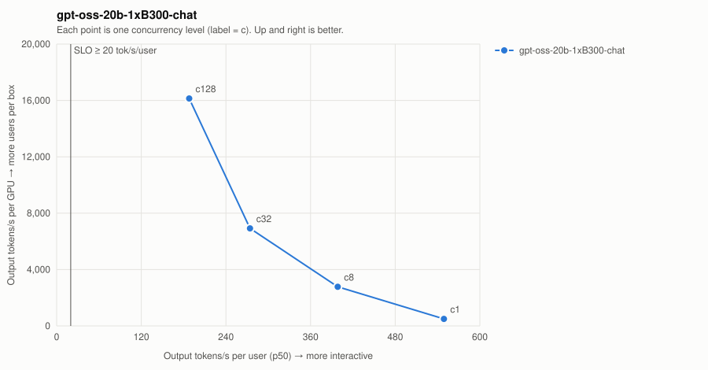

# gpt-oss-20b-1xB300-chat

| Series | Conc | Valid | Req/s | Out tok/s | GPUs | Out tok/s/GPU | tok/s/user p50 | TTFT p50/p99 ms | ITL p50/p99 ms | E2E p99 ms | SLO |
| --- | ---: | --- | ---: | ---: | ---: | ---: | ---: | ---: | ---: | ---: | --- |
| gpt-oss-20b-1xB300-chat | 1 | 16/16 | 1.94 | 496 | 1 | 496 | 549.0 | 47/50 | 1.8/1.8 | 518 | ✓ |
| gpt-oss-20b-1xB300-chat | 8 | 32/32 | 10.85 | 2,777 | 1 | 2,777 | 398.5 | 76/135 | 2.5/2.8 | 757 | ✓ |
| gpt-oss-20b-1xB300-chat | 32 | 128/128 | 27.03 | 6,919 | 1 | 6,919 | 274.1 | 241/285 | 3.6/3.9 | 1,269 | ✓ |
| gpt-oss-20b-1xB300-chat | 128 | 512/512 | 63.04 | 16,138 | 1 | 16,138 | 187.9 | 574/833 | 5.3/7.1 | 2,206 | ✓ |

SLO: TTFT p99 ≤ 2000 ms and per-user decode ≥ 20 tok/s. Failed points are failures, not low throughput — never average them in.
- **gpt-oss-20b-1xB300-chat**: highest SLO-passing concurrency = 128 → ≈ 853 active users at an assumed 15% duty cycle (fraction of wall-clock a user has a request in flight; measure yours from gateway logs).
