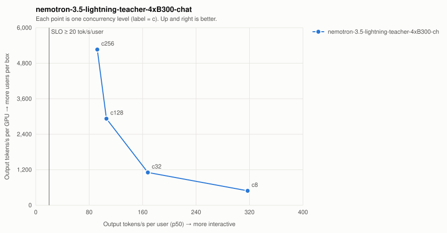

# nemotron-3.5-lightning-teacher-4xB300-chat

| Series | Conc | Valid | Req/s | Out tok/s | GPUs | Out tok/s/GPU | tok/s/user p50 | TTFT p50/p99 ms | ITL p50/p99 ms | E2E p99 ms | SLO |
| --- | ---: | --- | ---: | ---: | ---: | ---: | ---: | ---: | ---: | ---: | --- |
| nemotron-3.5-lightning-teacher-4xB300-chat | 8 | 32/32 | 7.61 | 1,948 | 4 | 487 | 317.2 | 84/482 | 3.2/4.2 | 1,371 | ✓ |
| nemotron-3.5-lightning-teacher-4xB300-chat | 32 | 128/128 | 17.32 | 4,433 | 4 | 1,108 | 167.8 | 193/241 | 6.0/8.1 | 2,186 | ✓ |
| nemotron-3.5-lightning-teacher-4xB300-chat | 128 | 512/512 | 45.73 | 11,707 | 4 | 2,927 | 105.8 | 261/358 | 9.5/13.4 | 3,641 | ✓ |
| nemotron-3.5-lightning-teacher-4xB300-chat | 256 | 1024/1024 | 82.24 | 21,054 | 4 | 5,264 | 92.2 | 217/475 | 10.9/13.2 | 3,554 | ✓ |

SLO: TTFT p99 ≤ 2000 ms and per-user decode ≥ 20 tok/s. Failed points are failures, not low throughput — never average them in.
- **nemotron-3.5-lightning-teacher-4xB300-chat**: highest SLO-passing concurrency = 256 → ≈ 1,707 active users at an assumed 15% duty cycle (fraction of wall-clock a user has a request in flight; measure yours from gateway logs).
