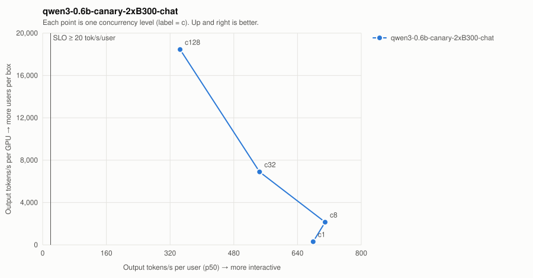

# qwen3-0.6b-canary-2xB300-chat

| Series | Conc | Valid | Req/s | Out tok/s | GPUs | Out tok/s/GPU | tok/s/user p50 | TTFT p50/p99 ms | ITL p50/p99 ms | E2E p99 ms | SLO |
| --- | ---: | --- | ---: | ---: | ---: | ---: | ---: | ---: | ---: | ---: | --- |
| qwen3-0.6b-canary-2xB300-chat | 1 | 16/16 | 2.36 | 604 | 2 | 302 | 679.3 | 45/50 | 1.5/1.5 | 435 | ✓ |
| qwen3-0.6b-canary-2xB300-chat | 8 | 32/32 | 16.75 | 4,289 | 2 | 2,144 | 709.2 | 46/49 | 1.4/1.8 | 519 | ✓ |
| qwen3-0.6b-canary-2xB300-chat | 32 | 128/128 | 53.86 | 13,787 | 2 | 6,894 | 544.6 | 52/72 | 1.8/2.4 | 655 | ✓ |
| qwen3-0.6b-canary-2xB300-chat | 128 | 512/512 | 144.18 | 36,911 | 2 | 18,455 | 345.2 | 95/152 | 2.9/3.4 | 967 | ✓ |

SLO: TTFT p99 ≤ 2000 ms and per-user decode ≥ 20 tok/s. Failed points are failures, not low throughput — never average them in.
- **qwen3-0.6b-canary-2xB300-chat**: highest SLO-passing concurrency = 128 → ≈ 853 active users at an assumed 15% duty cycle (fraction of wall-clock a user has a request in flight; measure yours from gateway logs).
