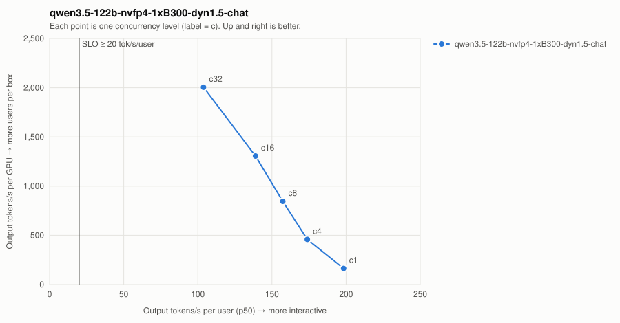

# qwen3.5-122b-nvfp4-1xB300-dyn1.5-chat

| Series | Conc | Valid | Req/s | Out tok/s | GPUs | Out tok/s/GPU | tok/s/user p50 | TTFT p50/p99 ms | ITL p50/p99 ms | E2E p99 ms | SLO |
| --- | ---: | --- | ---: | ---: | ---: | ---: | ---: | ---: | ---: | ---: | --- |
| qwen3.5-122b-nvfp4-1xB300-dyn1.5-chat | 1 | 16/16 | 2.55 | 163 | 1 | 163 | 198.4 | 69/73 | 5.0/5.1 | 391 | ✓ |
| qwen3.5-122b-nvfp4-1xB300-dyn1.5-chat | 4 | 32/32 | 7.16 | 458 | 1 | 458 | 173.8 | 196/223 | 5.8/5.8 | 581 | ✓ |
| qwen3.5-122b-nvfp4-1xB300-dyn1.5-chat | 8 | 64/64 | 13.21 | 845 | 1 | 845 | 157.3 | 197/216 | 6.4/6.4 | 616 | ✓ |
| qwen3.5-122b-nvfp4-1xB300-dyn1.5-chat | 16 | 128/128 | 20.40 | 1,306 | 1 | 1,306 | 138.9 | 320/341 | 7.2/7.7 | 805 | ✓ |
| qwen3.5-122b-nvfp4-1xB300-dyn1.5-chat | 32 | 256/256 | 31.33 | 2,005 | 1 | 2,005 | 103.8 | 401/486 | 9.6/12.6 | 1,039 | ✓ |

SLO: TTFT p99 ≤ 2000 ms and per-user decode ≥ 20 tok/s. Failed points are failures, not low throughput — never average them in.
- **qwen3.5-122b-nvfp4-1xB300-dyn1.5-chat**: highest SLO-passing concurrency = 32 → ≈ 213 active users at an assumed 15% duty cycle (fraction of wall-clock a user has a request in flight; measure yours from gateway logs).
