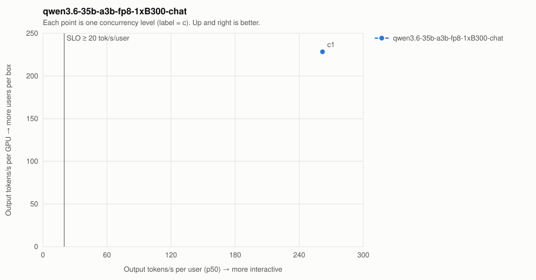

# qwen3.6-35b-a3b-fp8-1xB300-chat

| Series | Conc | Valid | Req/s | Out tok/s | GPUs | Out tok/s/GPU | tok/s/user p50 | TTFT p50/p99 ms | ITL p50/p99 ms | E2E p99 ms | SLO |
| --- | ---: | --- | ---: | ---: | ---: | ---: | ---: | ---: | ---: | ---: | --- |
| qwen3.6-35b-a3b-fp8-1xB300-chat | 1 | 16/16 | 0.89 | 228 | 1 | 228 | 261.8 | 139/143 | 3.8/3.8 | 1,121 | ✓ |
| qwen3.6-35b-a3b-fp8-1xB300-chat | 8 | **FAILED** (24/32) | — | — | — | — | — | — | — | — | ✗ |

SLO: TTFT p99 ≤ 2000 ms and per-user decode ≥ 20 tok/s. Failed points are failures, not low throughput — never average them in.
- **qwen3.6-35b-a3b-fp8-1xB300-chat**: highest SLO-passing concurrency = 1 → ≈ 7 active users at an assumed 15% duty cycle (fraction of wall-clock a user has a request in flight; measure yours from gateway logs).
